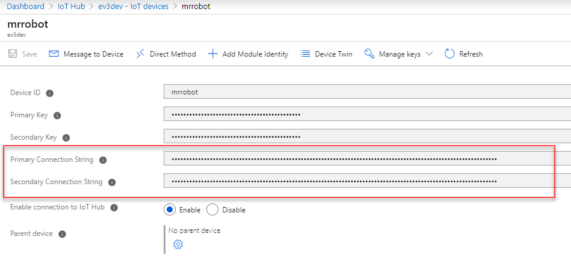
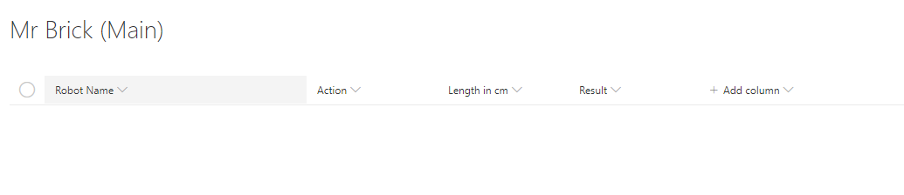

# Azure IoT Version

The Azure IoT version relies on a python script running on the LegoEV3.
To run python opn the lego bot you will need to run a custom image on a SDCARD.

Its super easy to setup.

just follow the steps on www.ev3dev.org to install the newest stretch image.

# Install
## Install requisites
### Python3 package installer
Install python3 package installer:
```
sudo apt-get update
sudo apt-get install python3-pip
```

### Paho MQTT
this message queue library works with Azure IoT and is used to make the connection.
Based on the the guide at https://www.ev3dev.org/docs/tutorials/sending-and-receiving-messages-with-mqtt/

Install it via this command
```
sudo pip3 install paho-mqtt
```

# Setup

## Azure IoT Hub
1. Provision a new Azure IoT hub resource in an azure subscription
1. Create a new device named "mrrobot" (or anything you like)
1. Note the device primary or secondary key for use on the robot
1. Update config_azureIoT.json file with the device info
1. Go to "shared access policies"
1. Open the "iothubowner" account and copy trhe connection string to use with the powershell script when calling the robot.

## Transfer files
1. Connect to the ev3dev via an FTP client that support SSH (for example FlashFXP)
1. Copy following files to the home directory:
    - baltimorebase64.cer
    - config_azureIoT.json
    - CTGlobal_LegoEV3_BaseClient.py
    - helper.py

## Connect Robot
1. The robot needs to be connected to the internet and ready to receive messages
1. Start the python script to start receiving messages
```
python3 CTGlobal_LegoEV3_BaseClient.py <configuration>
```
for example:
```
python3 CTGlobal_LegoEV3_BaseClient.py config_azureIoT.json

```

## Send Commands

Required Module:
AzureIoT:
https://www.powershellgallery.com/packages/AzureIoT/1.0.0.5

1. Control to the robot using the foloowing command
```
Import-Module PSLegoEV3WindowsPowerShell -Force

$AzureIoTConnectionString = Get-Content "C:\Temp\azureIotConnectionString.txt" #This is a txt file with the key saved, can be inserted directly here too
Connect-Ev3  -AzureIoTConnectionString $AzureIoTConnectionString

#Set default device to send to
Set-Ev3AzureIoTDeviceName -AzureIoTDeviceName "mrrobot"

#Actions can be called without any changes from the local version
Invoke-EV3Forward

#You can also specify device name on each call, good to use if you have multiple robot
Invoke-EV3Forward -AzureIoTDeviceName "mrrobot"
```

# Setup Self Service via SharePoint, Flow and Azure Automation

To enable self serviec you need the following:
- SharePoint Site
- Azure Automation Account
    - Add these modules
        - AzureIoT
        - PSLegoEV3WindowsPowerShell (From this repo)
- Azure IoT Hub Instance
    - Create a device per robot (example name: mrrobot)

Follow these steps to setup the self service frontend:

Below steps is also explained in this video:
https://youtu.be/Fo_8veVPz8c

- In the automation account add New-RobotFlowIoT.ps1 runbook
- Copy the connection string from Azure IoT Hub to Azure Automation Asset called "AzureIotConnectionString"

- Create a SharePoint List with the following columns
    - Title (Rename the default column to Device Name)
    - Action (Choice) with the following choices
        - Grab
        - Release
    - LengthinCm (integer)
 
- Create a flow to trigger on new items in the list
    - Use Template: "Start approval when a new item is added"
    - Add the Azure Automation Create Job Activity to the "if Yes" section
    - Select the New-RobotFlowIoT runbook
    - Pass the values to parameters
        - Device Name (Title) to AzureIoTDeviceName
        - Action to Action
        - LengthInCm to LengthInCm
    - Save the flow

## Start script on boot
(not working /complete)

sudo nano  /home/robot/start.sh
sudo chmod 777 /home/robot/start.sh

sudo nano /etc/systemd/system/azureiot.service


sudo systemctl daemon-reload
sudo systemctl enable azureiot.service

check status: 
sudo systemctl status -l azureiot.service
